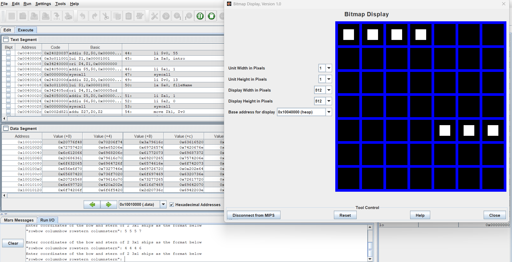

# Battleship Game

## Introduction
This is a Battleship game implemented in MIPS assembly language. The game allows two players to compete by strategically placing their ships and taking turns to attack each other's grid. The first player to destroy all of the opponent's ships wins.

## How to Play
1. **Setup Bitmap Display**:
   - Go to `Tools -> Bitmap Display`.
   - Set "Display Height in Pixels" to `512`.
   - Set "Base address for display" to `0x10040000` (heap).
   - Adjust the bitmap display area (the black area) to fit the screen.
   - Connect to MIPS.

2. **Assemble and Run**:
   - Assemble the `battleship.asm` file.
   - Clear breakpoints and run the program.

3. **Game Rules**:
   - Each player takes turns entering the coordinates of their ships.
   - Players then take turns entering the coordinates to attack the opponent's grid.
   - The game displays a 7x7 grid, and the row/column is 0-indexed.
   - The game logs each move and status in the `battleLog.txt` file.

4. **Winning Condition**:
   - The player who destroys all the opponent's ships first wins.

## Features
- **Interactive Gameplay**: Players input ship positions and attack coordinates.
- **Bitmap Display**: A visual representation of the game grid.
- **Error Handling**: Input validation for coordinates and ship placement.
- **Game Log**: All moves and game status are logged in `battleLog.txt`.

## Requirements
- MARS MIPS simulator.
- Proper configuration of the Bitmap Display as described above.

## Preview
The game interface and grid are visually represented using the bitmap display. Below is a sample preview:

## File Structure
- `battleship.asm`: The main game logic written in MIPS assembly.
- `sample.png`: A preview image of the game interface.
- `battleLog.txt`: Automatically generated log file for game moves and status.

## Notes
- Ensure the Bitmap Display is properly configured before starting the game.
- The game grid is 0-indexed, so coordinates range from `0` to `6`.

Enjoy the game!

